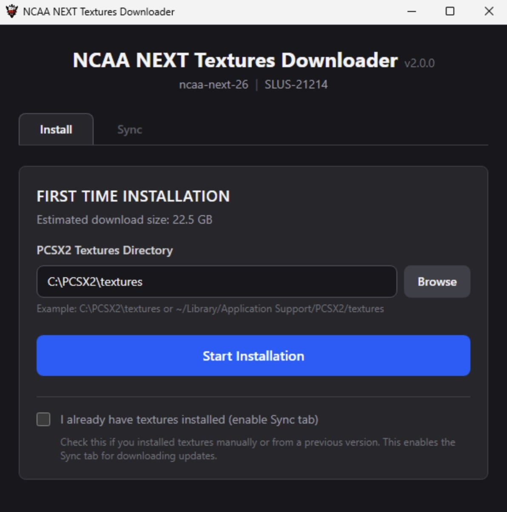
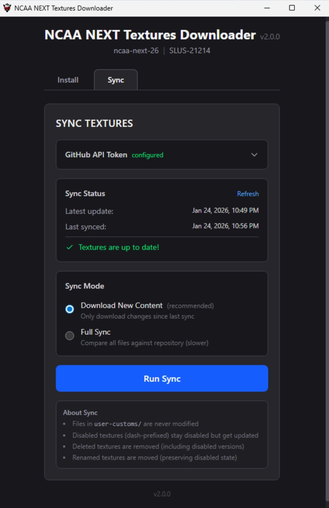
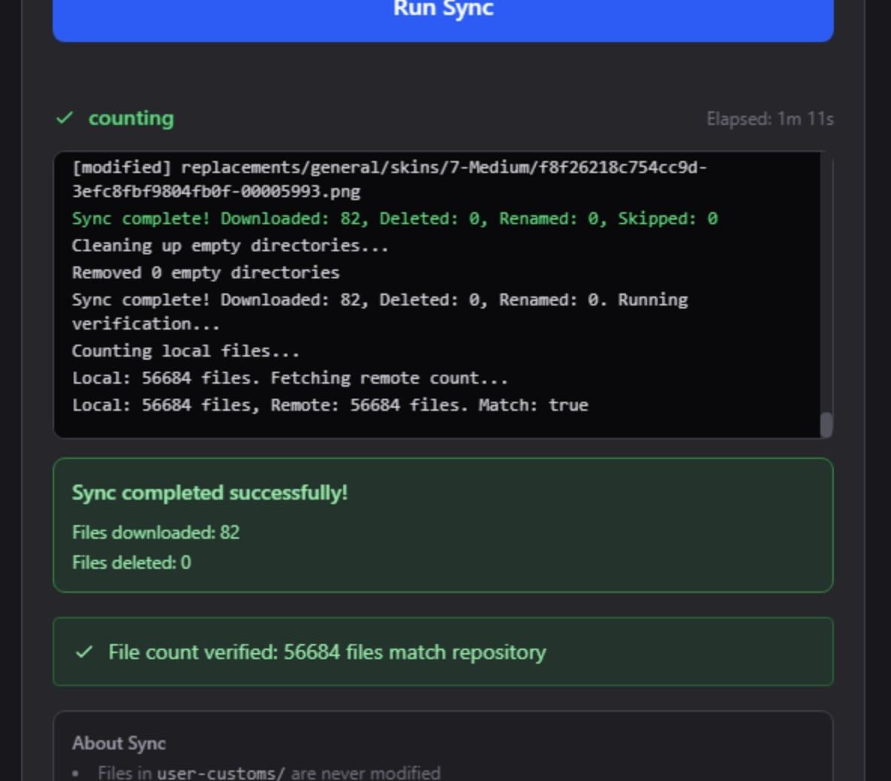
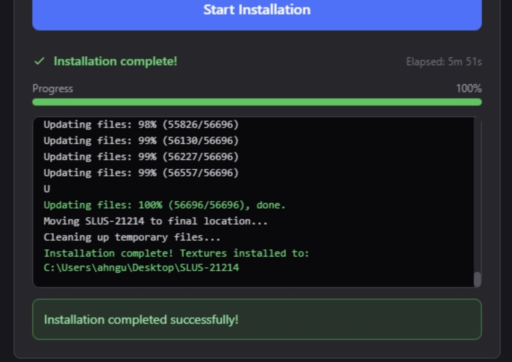
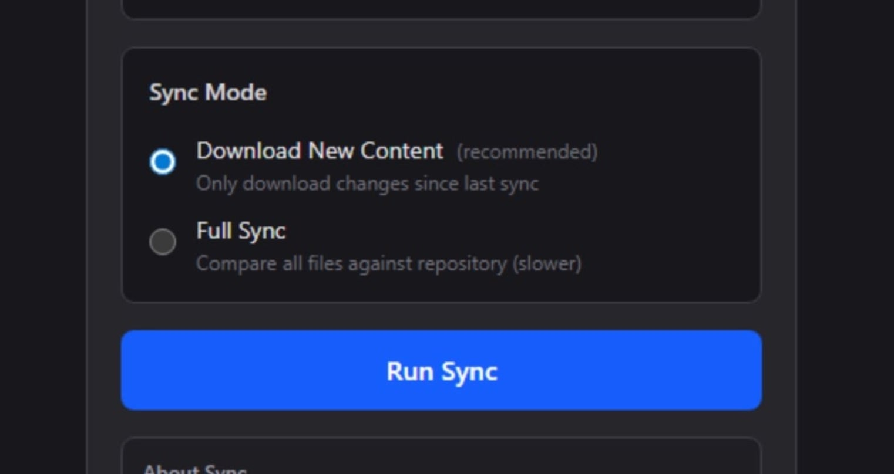
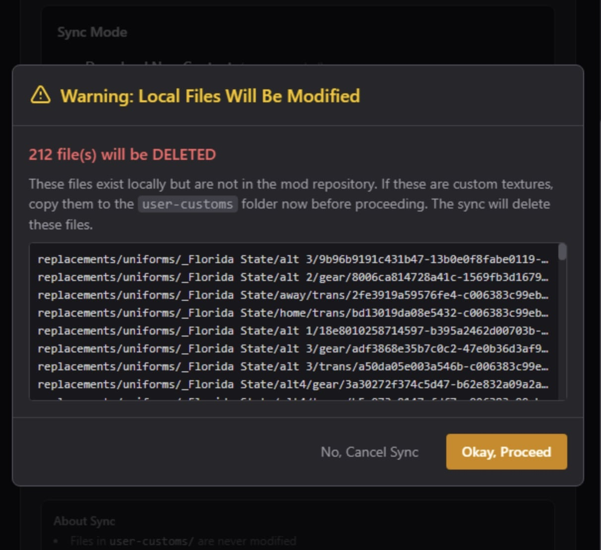
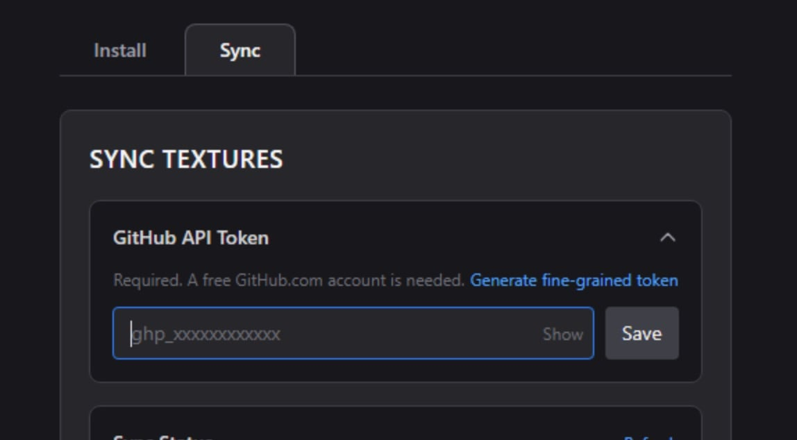

# NCAA NEXT Mod Textures Installer/Updater Tool 

This is a companion app for the [NCAA NEXT](https://www.ncaanext.com) mod that installs and updates the required textures pack.

## Table of Contents
- [Features](#features)
  - [Mod Installer](#introduction--installer)
  - [Mod Updater](#introduction--updater)
  - [Post-Sync Verification](#introduction--verification)
- [Handling User-Custom Textures](#custom-textures)
- [Installation](#installation)
  - [Windows](#installation--windows)
  - [macOS](#installation--macos)
- [Using the App](#usage)
  - [First Time Setup](#usage--setup)
  - [Updating and Syncing](#usage--sync)
- [Uninstalling](#uninstalling)
- [License](#license)

---

## Features <a name="features">

The NCAA NEXT mod requires a massive folder of replacement textures. This app helps manage the installation and upkeep of those textures. 

### Mod Installer <a name="introduction--installer">

The **First Time Setup** uses Git sparse checkout to efficiently download only the texture files you need (not the entire repository). This is faster and more reliable than downloading a massive zip file, which can fail or become corrupted. The installer automatically places textures in the correct location within your emulator's textures folder.



### Mod Updater <a name="introduction--updater">

The **Sync** feature keeps your textures up-to-date with two modes:

- **Download New Content** (Incremental Sync): Quickly grabs only the changes since your last sync. Uses the GitHub Compare API to identify new, modified, renamed, and deleted files.

- **Full Sync**: Compares every local file against the repository using SHA hash verification. Use this occasionally or when experiencing texture issues.

Both modes will:
- Download new and modified files
- Rename/move files that were reorganized
- Delete files that were removed from the project
- Preserve your disabled textures (dash-prefixed files)
- Never touch your `user-customs` folder



### Post-Sync Verification <a name="introduction--verification">

After every sync, the app performs a quick file count verification to ensure your local installation matches the repository. If a mismatch is detected, you'll be prompted to run a Full Sync to resolve discrepancies.



---

## Handling User-Custom Textures <a name="custom-textures">

This app is designed with texture customization in mind:

### The `user-customs` Folder

Put all of your custom textures in the `user-customs` folder (inside the `replacements` folder). **The app will never modify, update, or delete anything in this folder.** This is the safe place for your personal textures and DLC content.

### Disabling Default Textures

When using custom textures, you need to disable the mod's default texture so yours takes precedence. To do this:

1. **Keep the default texture in place** (don't delete it)
2. **Prepend the filename with a dash** (e.g., rename `3a30272f374c5d47.png` to `-3a30272f374c5d47.png`)

The dash prefix "disables" the texture - the emulator ignores it, but the app still recognizes it. When the mod team updates that texture, **your disabled version will be updated too**, keeping you in sync without breaking your custom texture.

**Important**: If you delete the default texture instead of disabling it, the sync will re-download it and potentially cause conflicts with your custom texture.

---

## Installation <a name="installation"></a>

### Windows <a name="installation--windows"></a>

1. Download `windows-portable.zip` from the [latest release](../../releases/latest)
2. Extract the zip file somewhere on your computer (e.g., `C:\Apps\` or your Desktop)
3. Open the extracted folder and run the `.exe` file to launch the app

**Note**: The app includes a bundled copy of Git (MinGit), so you don't need to install Git separately.

#### Updating the App (Windows)

1. Download the new `windows-portable.zip` from the latest release
2. Extract and replace the existing app folder
3. Your settings (including GitHub API token) are stored separately and will be preserved

### macOS <a name="installation--macos"></a>

1. Download the Mac installer file from the [latest release](../../releases/latest)
2. Open the DMG and drag the app to your Applications folder
3. On first launch, right-click the app and select "Open" to bypass Gatekeeper. In some cases you might need to go to Setting > Privacy & Security, scroll down, and allow the app to run in the Security settings section.

#### Updating the App (macOS)

Simply download the new `.dmg` and drag the app to your Applications folder, replacing the old version. Your settings are stored in your user Library folder and will be preserved.

---

## Using the App <a name="usage"></a>

### First Time Textures Installation <a name="usage--setup">

1. Select the **Install** tab
2. Browse to your PCSX2 textures folder. You can find the exact path in PCSX2 (or AetherSX2) at Settings > Graphics > Texture Replacements.
3. Click **Start Installation**
4. Wait for the download to complete (this may take a while for large texture packs)

The installer uses Git sparse checkout to efficiently download only the texture files. Progress is displayed in real-time. 

**Requirements for Mac Users Only**: Git must be installed. If you don't have it, install Xcode Command Line Tools by running in Terminal:
```bash
xcode-select --install
```



### Updating and Syncing <a name="usage--sync">

1. Select the **Sync** tab
2. Ensure your GitHub API Token is configured (instructions below)
3. Choose your sync mode:
   - **Download New Content**: Fast, only downloads changes since last sync (recommended for regular use)
   - **Full Sync**: Compares all files, slower but thorough (use occasionally or when troubleshooting)
4. Click **Run Sync**



**Warning Dialogs**: When running a Full Sync, if files will be replaced or deleted, you'll see a warning dialog listing the affected files. This gives you a chance to back up any custom textures to the `user-customs` folder before proceeding.



#### GitHub API Token (Required for Sync)

A GitHub Personal Access Token is required for the sync features. Here's how to get one:

1. Create a free Github account, if needed, and generate a "Fine-Grained" API token. Go to Settings > Developer Settings > Personal Access Tokens > Fine-Grained Tokens > [Generate New Token](https://github.com/settings/personal-access-tokens/new?name=Textures+Downloader&description=Token+for+syncing+textures&expires_in=365).
2. Give it a name (e.g., "NCAA NEXT Textures")
3. Set expiration to 1 year (maximum)
4. **No permissions are needed** - leave everything unchecked
5. Click "Generate Token" and copy it
6. Paste the token into the app's GitHub API Token field and click Save.



---

## Uninstalling <a name="uninstalling"></a>

#### Uninstalling (Windows)

1. Delete the app folder you extracted
2. To remove saved settings, delete `%LOCALAPPDATA%\com.ncaanext.textures-downloader` (paste this path
  in File Explorer's address bar)

#### Uninstalling (MacOS)

1. Delete the app from Applications
2. Delete `~/Library/Application Support/com.ncaanext.textures-downloader`

---

## License <a name="license">

PS2 Textures Downloader © 2024-2026 by JD6-37 is licensed under [CC BY-NC 4.0](http://creativecommons.org/licenses/by-nc/4.0/)

This license requires that reusers give credit to the creator. It allows reusers to distribute, remix, adapt, and build upon the material in any medium or format, for noncommercial purposes only.
